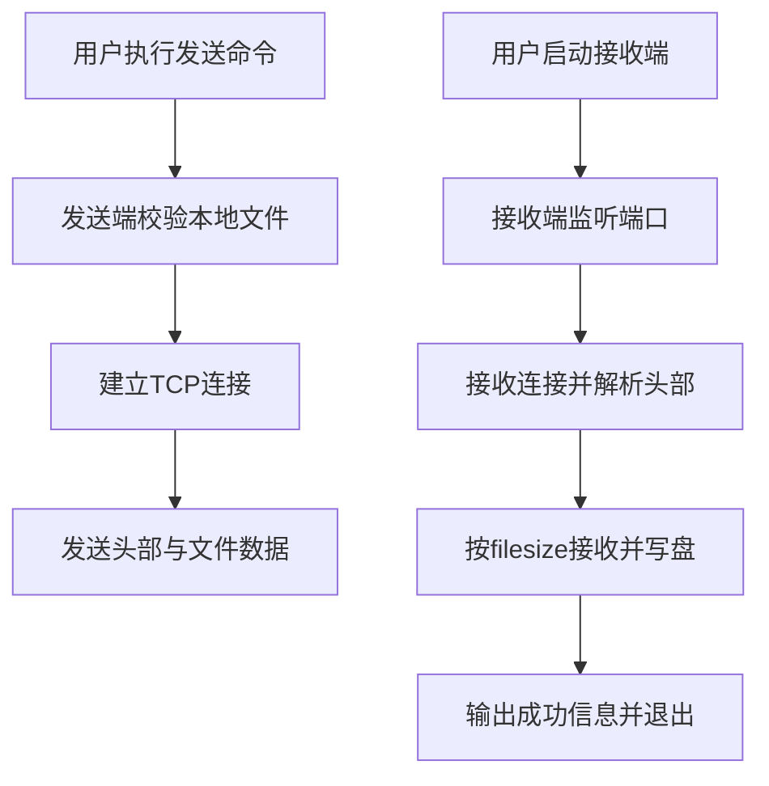
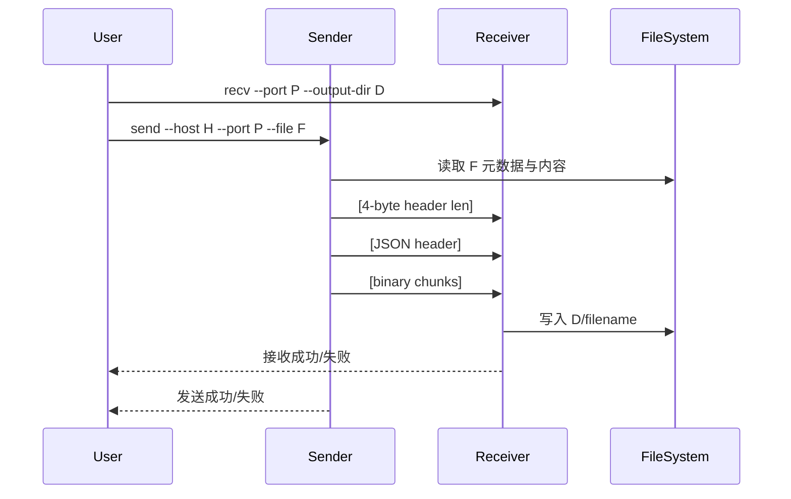

# 局域网文件传输工具 V1.0 需求分析报告

## 1. 文档状态与分析边界

- 输入文档：`requirements.md`（共 47 行，末尾停在协议示意部分）。
- 结论：已覆盖核心需求（FR-01~FR-06），但缺少非功能细项、验收步骤、异常码定义等内容。
- 本报告在不偏离原始范围的前提下补充工程实现所需细节，并显式标注假设。

### 1.1 关键假设

- V1.0 传输模型为“一次连接传一个文件，接收完成后接收端进程退出”。
- 接收目录若不存在则自动创建。
- 未明确冲突策略时采用“同名覆盖”。
- 默认接收目录解释为“命令执行入口所在目录”；若该目录不可写则回退到当前工作目录（CLI 可通过 `--output-dir` 显式指定）。

## 2. 功能需求梳理

| 编号 | 功能 | 约束与验收要点 |
|---|---|---|
| FR-01 | 发送单个文件 | 发送端需校验文件存在且为普通文件；连接成功后发送头部+正文 |
| FR-02 | 接收单个文件 | 监听端口，成功接收后按文件名落盘到目标目录 |
| FR-03 | 协议封装 | 格式固定：`4字节头长(网络序)+JSON头+二进制流` |
| FR-04 | 文件名保留 | 仅保留 basename，不接受带路径分隔符的文件名 |
| FR-05 | 基础错误处理 | 连接失败、文件不存在、端口冲突等需清晰报错并非零退出 |
| FR-06 | 命令行参数 | 通过 CLI 传入 host/port/file/output-dir/timeout 等参数 |

## 3. 非功能需求

### 3.1 可靠性

- 严格按 `filesize` 接收字节数，不足则报协议错误。
- 对头部长度设置上限（64KB）避免异常输入导致资源占用。

### 3.2 性能

- 采用分块流式传输（默认 64KB/chunk），避免一次性读入大文件。
- 在局域网场景下，吞吐受网卡/磁盘 IO 主导，程序应做到低额外开销。

### 3.3 兼容性

- Python 3.8+。
- 传输协议使用网络字节序 + UTF-8 JSON，兼容 Linux/Windows。
- 文件名不依赖平台特定路径语义（拒绝 `/`、`\\`）。

### 3.4 可维护性

- 分层实现（协议层、业务层、CLI 层）。
- 关键路径具备单元测试与集成测试覆盖。

## 4. 业务逻辑规则

1. 发送端读取本地文件元数据（basename + filesize）。
2. 构造 JSON 头并写入 4 字节头长前缀。
3. 建立 TCP 连接，先发头后发文件二进制数据。
4. 接收端先读 4 字节头长，再按长度读 JSON 头，解析文件元数据。
5. 接收端按 `filesize` 精确读取正文并写入本地文件。
6. 字节数校验通过则返回成功；任意环节异常立即失败退出。

## 5. 用户交互流程

## 6. 功能模块划分

- `CLI 模块`：参数解析、命令分发、终端输出、退出码管理。
- `协议模块`：头部编解码、元数据校验、定长读取。
- `发送模块`：文件校验、连接建立、分块发送。
- `接收模块`：监听与接收、落盘、字节完整性校验。
- `错误模块`：配置错误、网络错误、协议错误统一建模。

## 7. 数据流程图

## 8. 用户故事

- 作为开发者，我希望在 Linux 服务器上快速接收 Windows 机器上的日志文件，以便排查问题。
- 作为办公用户，我希望通过命令行一条命令发送文件，不依赖外网服务。
- 作为学习者，我希望看到明确的自定义协议实现，为后续断点续传迭代做准备。

## 9. 技术难点、性能瓶颈与兼容性风险

### 9.1 技术难点

- TCP 粘包/拆包：需先读固定 4 字节再读变长头部。
- 非法输入防护：需校验 JSON 结构、文件名合法性、filesize 合法性。

### 9.2 性能瓶颈

- 大文件传输速度受网络带宽与磁盘写入速度约束。
- 单线程单连接模型不适合并发传输（V1.0 不要求并发）。

### 9.3 兼容性要求

- Socket 与路径处理必须避免依赖 Linux 专有行为。
- UTF-8 编码保证中英文文件名可传递。

## 10. 验收标准（V1.0）

- 能在两台主机间成功传输一个文件且内容一致。
- 接收端落盘文件名与发送端 basename 一致。
- 出错场景具备明确报错与非零退出码。
- 所有自动化测试通过。
